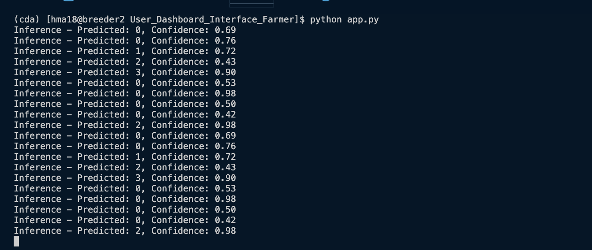

# Reliable Livestock AI: Safe Decision Support Under Imperfect Data

## Problem Statement
Feeding is the highest cost in a feedlot for beef cattle production. Because of this, feed management is one of the most important daily decisions in feedlot systems. Animals are fed in feed bunks, and producers usually evaluate how much feed remains in the bunk before the next feeding. This evaluation generates what is known as a bunk score, which helps determine whether the next ration should be increased, decreased, or maintained.

However, in most operations, this process is still performed manually, where workers walk through the feedlot and visually inspect each bunk. This method can be subjective, labor-intensive, and inconsistent, especially in large feedlots with hundreds of pens.

Based on that, livestock farms increasingly rely on camera and sensor monitoring systems to detect health, feeding, and welfare issues, aiming to improve decision-making and reduce manual labor.
## Solution Overview
An AI system to automatically monitor feed levels in feed bunks using the Feed Bunk Score concept.

The system uses camera-based monitoring to evaluate feed availability in real time, generating bunk scores that support feeding decisions such as increasing, decreasing, or maintaining the next ration.

To ensure reliable decision support, the system also incorporates a noise-aware reliability layer, designed to detect uncertain or low-quality data caused by factors such as poor lighting, occlusions, or sensor failures. When the system detects low confidence in the data, it can flag the bunk for human verification, ensuring safe and robust management decisions.

This approach aims to reduce manual labor, improve consistency in bunk scoring, and support data-driven feed management in feedlot systems.

## Technical Approach 

### Installation
```bash
git clone https://github.com/Hasnat79/cda_comp
pip install -r requirements.txt
```
#### Alternatively you can install following packages
```
pip install torch torchvision torchaudio --index-url https://download.pytorch.org/whl/cu118
pip install timm
pip install matplotlib
pip install pandas
pip install opencv-python
pip install seaborn
pip install Flask==2.3.2 Werkzeug==2.3.6
```


### Project Structure
```
├── outputs
│   ├── eda
│   │   ├── eda_background_format.png
│   │   └── eda_overview.png
│   ├── models
│   │   ├── advanced_vit_best.pth
│   │   └── baseline_simple_cnn_best.pth
│   └── plots
│       ├── advanced_vit_confusion_matrix.png
│       ├── advanced_vit_training_history.png
│       ├── baseline_simple_cnn_confusion_matrix.png
│       └── baseline_simple_cnn_training_history.png
├── README.md
├── requirements.txt
└── src
    ├── data.py
    ├── eda
    │   └── eda.py
    ├── main.py
    ├── model.py
    ├── __pycache__
    │   ├── data.cpython-310.pyc
    │   ├── model.cpython-310.pyc
    │   └── trainer.cpython-310.pyc
    ├── trainer.py
    └── User_Dashboard_Interface_Farmer
        ├── app.py
        ├── QUICKSTART.md
        ├── README.md
        ├── requirements.txt
        ├── static
        │   ├── score-0_1.jpg
        │   ├── score-0_26.jpg
        │   ├── score-0.5_43.jpg
        │   ├── score-0.5_4.jpg
        │   ├── score-0_82.jpg
        │   ├── score-1_4.jpg
        │   ├── score-2_44.jpg
        │   ├── score-2_55.jpg
        │   ├── score-3_3.jpg
        │   └── score-4_0.jpg
        └── templates
            └── dashboard.html
```

### Train the model
```
# Basic training (uses defaults)
python main.py train

# Most common options
 python main.py train --model-name test \
 --model-type feedbunk \
 --batch-size 64 \
 --epoch 1 \
 --output-dir ../outputs

# Using the simpler CNN architecture
python main.py train \
  --model-name baseline_cnn_v1 \
  --model-type simple_cnn \
  --epochs 50
```

### Evaluate a saved model
```
# Basic usage
python main.py evaluate \
  --model-path cda_comp/outputs/models/advanced_vit_best.pth

# With custom batch size and output folder
python main.py evaluate \
  --model-path cda_comp/outputs/models/advanced_vit_best.pth\
  --batch-size 128 \
  --output-dir ../outputs/eval_results \
  --model-name cnn_eval_run
  --model-type simple_cnn
```

### Run inference on a single bunk image
```

# Quick inference
python main.py infer \
  --model-path cda_comp/outputs/models/advanced_vit_best.pth \
  --image cda_comp/src/User_Dashboard_Interface_Farmer/static/score-0_26.jpg

# Using the simple CNN model
python main.py infer \
  --model-path /data/hma18/CDA_hackathon/cda_comp/outputs/models/baseline_simple_cnn_best.pth \
  --image cda_comp/src/User_Dashboard_Interface_Farmer/static/score-0_26.jpg \
  --model-type simple_cnn
```


## Result for Demonstration
### Dashboard


### Backend Logs


## Instruction for Running the Prototype
```
cd cda_comp/src/User_Dashboard_Interface_Farmer
python app.py
```